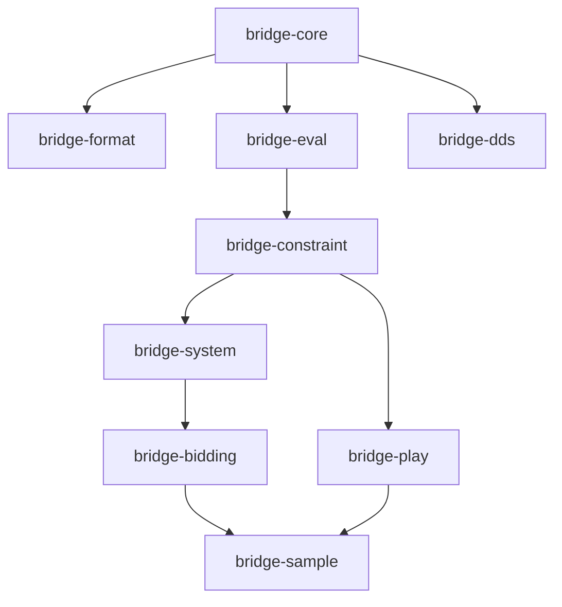

# 01. ワークスペース構成

本文書はワークスペースの物理構成、クレートの分割と責務、依存の向き、feature、外部依存の版、ツールチェーンを確定する。仕様 §2 のクレート構成を踏襲し、`bridge-dds` と `xtask` を除く全クレートが `wasm32-unknown-unknown` でビルドできることを設計上の制約とする。ここで決めた名前と版は各クレート文書と `Cargo.toml` の正となる。

## 1. ディレクトリ構成

```
bridge_engine/
├── Cargo.toml                 # [workspace] resolver = "3", members = ["crates/*", "xtask"]
├── rust-toolchain.toml        # channel = "stable", components = ["rustfmt", "clippy"]
├── .gitignore                 # target/, corpus/data/, systems/vendor/data/, crates/bridge-dds/vendor/
├── .github/workflows/ci.yml
├── crates/
│   ├── bridge-core/           # L0 ドメイン型
│   ├── bridge-format/         # PBN / LIN / Deal 文字列
│   ├── bridge-eval/           # 評価関数
│   ├── bridge-constraint/     # HandConstraint と厳密サンプラー
│   ├── bridge-system/         # BML パーサ・コンパイラ・SystemIR
│   ├── bridge-bidding/        # interpret / choose_bid
│   ├── bridge-play/           # プレイ履歴からの制約
│   ├── bridge-sample/         # 配牌サンプラー
│   ├── bridge-dds/            # vendor/dds-2.9.0/ (git-ignored), build.rs, VENDOR.md, src/{sys,convert}.rs, src/layout_probe.cpp, tests/layout.rs
│   └── bridge/                # ファサード (再エクスポート)
├── xtask/                     # corpus fetch, systems fetch, dds vendor, dds regen-bindings, coverage (src/main.rs)
├── systems/                   # 自作 sayc.bml (two-over-one.bml は任意)、fixtures/、vendor/manifest.toml
├── corpus/manifest.toml       # PBN/LIN コーパスの URL + sha256 (データは含めない)
└── docs/design/               # 本設計
```

フェーズ 0 の骨格 (`12-roadmap.md` §1) で上記の全てが揃う。`crates/*/src/` は公開型と関数シグネチャを英語 rustdoc 付きで宣言し、本体は `todo!("phase N")`。`xtask/src/main.rs` はサブコマンドの枠だけ (全て「未実装」で終了コード 1)、`systems/` は `README.md` のみ、`corpus/manifest.toml` は sha256 が空、`crates/bridge-dds/` は `build.rs`、`VENDOR.md`、`src/layout_probe.cpp` を含む。

## 2. クレート一覧と責務

| クレート | 層 | 責務 | 依存先 (内部) | 外部依存 | 設計文書 |
| --- | --- | --- | --- | --- | --- |
| `bridge-core` | L0 | カード・ハンド・シェイプ・席・コール・オークション・ディール・プレイ履歴・`DdTable` の型と規則 | なし | `thiserror`, `serde` (optional) | `02-core.md` |
| `bridge-format` | L0 周辺 | PBN 2.1 / LIN の lenient パーサとライタ、Deal 文字列 | `core` | `winnow`, `thiserror`, `serde` (optional) | `03-format.md` |
| `bridge-eval` | L1 | HCP・コントロール・LTC・QT・分布点・スート品質 | `core` | `serde` (optional) | `04-eval.md` |
| `bridge-constraint` | L1 | `HandConstraint`、DNF 正規化、厳密サンプラー、`KnownCards` | `core`, `eval` | `rand_core`, `tracing`, `thiserror`, `serde` (optional) | `05-constraint.md` |
| `bridge-system` | L2 | BML パーサ、展開、説明文コンパイラ、`SystemIR`、`AuctionTrie`、ナチュラル推定、Lint、キャッシュ | `core`, `eval`, `constraint` | `winnow`, `smallvec`, `thiserror`, `tracing`, `serde` (optional), `postcard` + `blake3` (feature `cache`) | `06-system.md` |
| `bridge-bidding` | L3 | `interpret` / `choose_bid` / `call_distribution` / `replay` | `core`, `constraint`, `system` | `smallvec`, `tracing`, `serde` (optional) | `07-bidding.md` |
| `bridge-play` | L5 | プレイ履歴からのハード制約、リード・シグナル規則表 | `core`, `constraint` | `thiserror`, `serde` (optional) | `08-play.md` |
| `bridge-sample` | L4 | `Proposal` トレイト、重点重み付け、ESS、決定的並列 | `core`, `constraint`, `bidding`, `play` | `rand_core`, `rand_xoshiro`, `rayon` (optional), `thiserror`, `tracing`, `serde` (optional) | `09-sample.md` |
| `bridge-dds` | FFI | DDS v2.9.0 の `cc` ビルドと安全ラッパー | `core` (`std` 必須) | `thiserror`, `cc` (build) | `10-dds.md` |
| `bridge` | ファサード | 全クレートの再エクスポート、`dd::DoubleDummy` トレイト | 全部 | `thiserror` | `10-dds.md` |
| `xtask` | ツール | コーパス取得、外部 BML 取得、DDS ベンダリング、bindgen オフライン生成、カバレッジレポート | なし (ワークスペース外の依存のみ) | フェーズ 1 で `ureq`, `sha2`, `zip`、フェーズ 5 で `bindgen` | `11-testing.md` |

クレート名は `bridge-*`、ライブラリ名は `bridge_*`。上位アプリは原則ファサード `bridge` のみに依存する。

## 3. 依存の向き



規則:

1. 依存は下から上の一方向のみ。循環は禁止で、`cargo deny` の設定と `cargo check` が検出する。
2. `bridge-play` は `bridge-system` に依存しない (仕様 §2)。プレイ側の約束はビディングシステムと独立に更新される。
3. `bridge-constraint` は `bridge-system` から独立している。制約言語はテストデータ生成・利用者の絞り込み・プレイからの推論にも使う。
4. `bridge-dds` は `bridge-core` にのみ依存し、C++ ビルドを他クレートへ波及させない。`wasm32` では `compile_error!` する。
5. ファサード `bridge` は `[target.'cfg(not(target_arch = "wasm32"))'.dependencies]` で `bridge-dds` を optional に持つ。
6. `SystemIR` は構築後不変で `Arc` 共有する。解決結果のキャッシュは呼び出し側が持ち、下位クレートは内部可変性を持たない (仕様 §9)。

## 4. feature

| クレート | feature | 既定 | 内容 |
| --- | --- | --- | --- |
| 全クレート | `std` | on | `default = ["std"]`。`no_std` は非目標だが、将来のために feature 名を予約する |
| 全クレート | `serde` | off | `serde = ["dep:serde"]`。上位クレートは下位の `serde` を伝播させる (`bridge-constraint/serde` は `bridge-core/serde`, `bridge-eval/serde` を有効化) |
| `bridge-sample` | `parallel` | off | `parallel = ["dep:rayon"]`。WASM では無効 |
| `bridge-system` | `cache` | off | `cache = ["std", "serde", "dep:postcard", "dep:blake3"]`。`cache.rs` (`SystemCache`) を有効化 |
| `bridge-dds` | `openmp` | off | `DDS_THREADS_OPENMP` でビルド。既定は `DDS_THREADS_STL` |
| `bridge` | `format` | on | `format = ["dep:bridge-format"]`。`bridge::format` の再エクスポート |
| `bridge` | `parallel` | off | `bridge-sample/parallel` |
| `bridge` | `cache` | off | `bridge-system/cache` |
| `bridge` | `dds` | off | `dds = ["dep:bridge-dds"]`。非 wasm のみ |

ファサードの既定は `default = ["std", "format"]`。`bridge-dds` は `default = []` で `std` feature を持たず、`bridge-core` を `features = ["std"]` で参照する。

ファサード `bridge` のモジュール構成 (`crates/bridge/src/lib.rs`): ルートに `bridge_core::*`、`eval` (`bridge-eval`)、`constraint`、`system`、`bidding`、`play`、`sample`、`format` (feature `format`)、`dd` (`DdTable`、`DoubleDummy` トレイト、`DdError`、`dds()`。`10-dds.md` §9)。

`bridge-core` の `Cargo.toml` (フェーズ 0 で確定済み):

```toml
[features]
default = ["std"]
std = []
serde = ["dep:serde"]

[dependencies]
serde = { workspace = true, optional = true }
thiserror = { workspace = true }

[dev-dependencies]
proptest = { workspace = true }
```

## 5. 外部依存とバージョン

crates.io の現行版を確認して固定した (D14)。全て `[workspace.dependencies]` に置き、各クレートは `{ workspace = true }` で参照する。

| クレート | 版 | 用途 | 使用クレート |
| --- | --- | --- | --- |
| `thiserror` | 2 | エラー型 | 全クレート |
| `serde` | 1 (optional, `derive`) | シリアライズ | 全クレート |
| `winnow` | 1.0 | パーサコンビネータ | `format`, `system` |
| `rand` / `rand_core` | 0.10 (`default-features = false`) | RNG トレイト。クレートが使うのは `rand_core::Rng` (dyn 互換の基底) だけで、`rand` はワークスペース依存として版を予約する | `constraint`, `sample` (`rand_core`) |
| `rand_xoshiro` | 0.8 | `Xoshiro256PlusPlus` (D12) | `sample` (dev: `constraint`, `bidding`) |
| `rayon` | 1.12 (optional) | 並列サンプリング | `sample` |
| `tracing` | 0.1 (`default-features = false`) | ログ (認識率、ESS、DNF 爆発の警告) | `constraint`, `system`, `bidding`, `sample` |
| `smallvec` | 1 | ホットパスの小ベクタ | `system`, `bidding` |
| `postcard` | 1 (`alloc`, optional) | `SystemIR` キャッシュのエンコード | `system` (feature `cache`) |
| `blake3` | 1 (optional) | キャッシュキー | `system` (feature `cache`) |
| `cc` | 1.4 (build) | DDS の C++ ビルド | `dds` |
| `proptest` | 1.11 (dev) | プロパティテスト | `core`, `format`, `constraint`, `bidding` |
| `criterion` | 0.8 (dev, `html_reports`) | ベンチ | `eval`, `constraint`, `bidding`, `sample` |
| `insta` | 1 (dev) | スナップショット | `format`, `system` |
| `bindgen` | 0.73 (xtask のみ、フェーズ 5) | バインディングのオフライン再生成 | `xtask` |
| `ureq`, `sha2`, `zip` | 現行 (xtask のみ、フェーズ 1) | コーパス・BML・DDS の取得と検証 | `xtask` |

版の理由: `winnow` は仕様の 0.7 が旧版のため 1.0。`rand` 0.8 の `gen()` は edition 2024 で予約語 `gen` と衝突するため 0.10 (`random_range` 等)。`criterion` 0.8 は現行。

## 6. edition、MSRV、プロファイル

```toml
[workspace]
resolver = "3"
members = ["crates/*", "xtask"]

[workspace.package]
version = "0.0.1"
edition = "2024"
rust-version = "1.85"
license = "MIT OR Apache-2.0"

[profile.release]
debug = 1          # サンプラーのプロファイル用にシンボルを残す
lto = "thin"

[profile.bench]
inherits = "release"
```

| 項目 | 値 | 備考 |
| --- | --- | --- |
| edition | 2024 | RPIT が in-scope lifetime を暗黙捕捉する (`calls_by(&self) -> impl Iterator` が `self` を借用) |
| MSRV | 1.85 | edition 2024 の最小版。CI に MSRV ジョブを置く |
| 開発ツールチェーン | stable 1.96.1 | `rust-toolchain.toml` は `channel = "stable"` |
| resolver | 3 | MSRV 対応レゾルバ |
| 内部クレートの参照 | `path` + `version = "0.0.1"` + `default-features = false` | 上位クレートが feature を明示的に選ぶ |

`const fn` で使える機能は stable の範囲に限る (トレイト呼び出し・`?`・heap 不可)。詳細は `02-core.md` §7。

## 7. CI 概要

詳細は `11-testing.md`。GitHub Actions で ubuntu / macos / windows の 3 OS。

| ジョブ | 内容 |
| --- | --- |
| `lint` | `cargo fmt --all --check` → `cargo clippy --workspace --all-targets --all-features -- -D warnings` |
| `test` (3 OS) | `cargo test --workspace` → `cargo test --workspace --all-features` → `cargo bench --workspace --no-run` |
| `wasm` | `cargo check --workspace --exclude bridge-dds --exclude xtask --target wasm32-unknown-unknown` と、ファサードの `--no-default-features --features std,format,serde` |
| `msrv` | 1.85 で `cargo check --workspace --exclude xtask` |
| `deny` | `cargo deny check licenses` |
| `nightly` (スケジュール) | `cargo xtask corpus fetch` → `cargo xtask dds vendor` → `cargo test --release --workspace --all-features -- --ignored` (整合性 10^6 配牌、ESS、コーパス、DDS 差分) → `cargo bench --workspace` |

フェーズ 0 の骨格は各クレートの `lib.rs` に `#![allow(dead_code, unused_variables)]` を置き、`todo!()` 本体の未使用引数の警告を抑える。本体を実装するクレートから順にこの allow を外し、実装後に残る未使用は `let _ = ...` ではなくコードの整理で解消する。DDS ソースの取得とレイアウトテストを毎 PR で回す専用 `dds` ジョブはフェーズ 5.5 で追加する。

## 8. ディレクトリ規約

| ディレクトリ | 内容 | コミット対象 |
| --- | --- | --- |
| `crates/<name>/src/` | ライブラリ本体。`lib.rs` は `#![forbid(unsafe_code)]` (`bridge-dds` を除く) と `#![warn(missing_docs)]` | する |
| `crates/<name>/tests/` | 統合テスト。`--ignored` の重いテストもここ | する |
| `crates/<name>/benches/` | criterion ベンチ | する |
| `crates/bridge-dds/vendor/` | DDS v2.9.0 のソース (`cargo xtask dds vendor` で取得、`VENDOR.md` にタグ・sha・日付) | しない (`.gitignore`) |
| `systems/` | `README.md`、自作 `sayc.bml`、`fixtures/*.bml` (変数・paste・seat/vul・競り合い) | する |
| `systems/vendor/manifest.toml` | gpaulissen/bml のテストデータと期待 `.bss`、選抜した実ファイルの URL + sha256 | する (データ本体 `systems/vendor/data/` はしない) |
| `corpus/manifest.toml` | PBN/LIN コーパスの URL + sha256 | する (データ本体 `corpus/data/` はしない) |
| `docs/design/` | 本設計 (日本語) | する |
| `xtask/` | `cargo xtask <cmd>`: `corpus fetch`, `systems fetch`, `dds vendor`, `dds regen-bindings`, `coverage` (`xtask/src/main.rs` に枠あり) | する |
| `target/` | ビルド成果物 | しない |

環境変数: `BRIDGE_CORPUS_DIR` 未設定ならコーパス依存テストはスキップする。`systems/vendor/data/` 未取得なら外部 BML テストもスキップする。

## 9. コード規約 (全クレート共通)

- doc コメント・識別子・エラーメッセージは英語。設計文書は日本語。
- `Copy` 可能な型は全て `Copy`。`#[repr(u8)]` enum は `from_index` / `index` を `const fn` で提供する。
- 演算子トレイト (`BitOr` 等) は非 const で inherent const fn に委譲する。
- エラーは `thiserror` でクレートごとに定義し、`anyhow` は使わない。「制約を満たす手が無い」「候補ビッドが無い」はエラーではなく戻り値 (仕様 §9)。
- パニックは `debug_assert!` による内部不変条件と、公開 API の契約違反 (`Suit::from_index(4)` 等) に限る。
- `tracing` は構造化フィールドのみ出力し、`INFO` で認識率と ESS、`WARN` で DNF 爆発と `Custom` を含むサンプリングを報告する。

## 10. 未決

- 未決: `cargo deny` の設定ファイル (`deny.toml`) の許可ライセンス一覧は DDS (Apache-2.0) の取り込み時 (フェーズ 5.5) に確定する。

`xtask` のサブコマンド名は `xtask/src/main.rs` で `corpus fetch` / `systems fetch` / `dds vendor` / `dds regen-bindings` / `coverage` に確定した。
