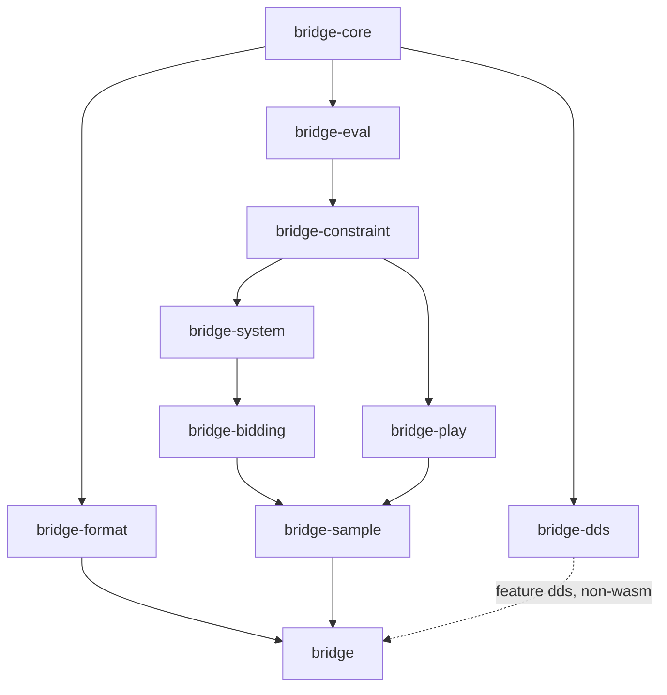

# 設計ドキュメント索引

本ディレクトリは仕様書「ブリッジ基盤ライブラリ Rust実装仕様書」(2026-09-18 版) を実装可能な粒度に落とした詳細設計である。各クレートの公開型と関数シグネチャ、仕様が方針に留めていた箇所のアルゴリズム、仕様からの意図的な差分と決定事項をここで確定する。ソースコードのコメント・識別子・エラーメッセージは英語、設計ドキュメントは日本語とする。

## 1. ドキュメント一覧

| # | ファイル | 対象 | 概要 |
| --- | --- | --- | --- |
| 00 | `README.md` | 索引 | 本ファイル。読み方、仕様との対応表、クレート依存図 |
| 01 | `01-workspace.md` | ワークスペース | 物理構成、クレート一覧と責務、依存の向き、feature、外部依存の版、edition/MSRV、CI 概要、ディレクトリ規約 |
| 02 | `02-core.md` | `bridge-core` (L0) | ビット配置、全公開型の完全なシグネチャ、オークション合法性、コントラクト導出、トリック勝者、`DdTable`、Display/FromStr、エラー、serde、const fn 制約、落とし穴 |
| 03 | `03-format.md` | `bridge-format` | PBN 2.1 / LIN / Deal 文字列の読み書き、lenient パーサ、`GameView`、Warning、ラウンドトリップ、コーパス |
| 04 | `04-eval.md` | `bridge-eval` (L1) | `Half`、ビット演算による線形指標、`const` スートテーブル、LTC/QT/オナーの式、`DistMethod`、性能目標 |
| 05 | `05-constraint.md` | `bridge-constraint` (L1) | `Atom`/`HandConstraint`/DNF 型、交差と否定、爆発対策、充足不能判定、厳密サンプラー、和集合サンプリングと `log_prob`、`KnownCards` |
| 06 | `06-system.md` | `bridge-system` (L2) | BML の実態、AST とパーサ、`CallPattern` と展開、`SystemIR`、`AuctionTrie`、説明文コンパイラ、ナチュラル推定、Lint、キャッシュ |
| 07 | `07-bidding.md` | `bridge-bidding` (L3) | `Table`、`interpret` の Step A/B、ε 混合、`choose_bid` と `BidChoice`、確率的方策、尤度、`replay` |
| 08 | `08-play.md` | `bridge-play` (L5) | プレイ履歴からのハード制約 (`hard_constraints`)、`KnownCards::with_play`、リード表・シグナル表の規則 |
| 09 | `09-sample.md` | `bridge-sample` (L4) | `Proposal`/`PreparedProposal`、重点重み付けと ESS、`UniformProposal`/`ConstraintProposal`、決定的並列 |
| 10 | `10-dds.md` | `bridge-dds` | DDS v2.9.0 のベンダリング、`build.rs`、手書き `#[repr(C)]` とレイアウト検証、安全ラッパー、ファサードの `dds` feature |
| 11 | `11-testing.md` | テスト戦略 | 各クレートのテスト種別と基準、双方向整合性、再現率、ベンチ、CI とナイトリー |
| 12 | `12-roadmap.md` | 実装順序 | フェーズ 0〜6 の PR 単位タスクと完了条件、リスク一覧 |
| 13 | `13-decisions.md` | 決定記録 | D1〜D17 の ADR (決定・理由・仕様との差分・影響クレート) |

## 2. 読み方

1. 初めて読む場合は `01-workspace.md` で全体像を掴み、`13-decisions.md` で仕様との差分を確認してから各クレートの文書へ進む。
2. クレートの文書は下位層から順に依存している。`02-core.md` の型と表記 (ビット配置、♠.♥.♦.♣ の表示順、`Bid` の整数化) は全文書の前提なので最初に読む。
3. 各文書は冒頭 2〜3 文で「何を決めたか」を述べ、以降は表と Rust コードブロックで定義を示す。アルゴリズムは番号付き手順で書く。
4. 未確定の事項は本文中に「未決」と明示し、1 行の補足を付けている。未決の項目は `12-roadmap.md` のフェーズで解消時期を示す。
5. 仕様と本設計が食い違う場合は本設計 (特に `13-decisions.md`) を正とする。設計間で食い違う場合は `02-core.md` → `05-constraint.md` → 上位の順に下位層を正とする。
6. コード中の doc コメントは英語で書き、設計ドキュメントとは識別子で対応付ける。文書に書いた型名・関数名はコードと一致させる (ずれたらコードではなく文書を直す)。フェーズ 0 の骨格 (`crates/*/src/`) が型名・フィールド名・シグネチャ・モジュール配置・feature 名の正であり、本ディレクトリの文書はそれに合わせて整合済みである。

## 3. 仕様の章と設計ドキュメントの対応

| 仕様の章 | 内容 | 主に扱う文書 | 補足する文書 |
| --- | --- | --- | --- |
| §1 目的・スコープ・設計原則 | 単一のシステム定義から解釈器と生成器を導出、品質目標 | `README.md`, `01-workspace.md` | `11-testing.md` (品質目標の測定), `13-decisions.md` |
| §2 クレート構成と依存関係 | 9 クレート + ファサード、依存の向き、命名規約 | `01-workspace.md` | `10-dds.md` (WASM 除外) |
| §3 L0 コアドメイン型 | `Card`/`Hand`/`Shape`/`Auction`/`Deal`/`PlayHistory` | `02-core.md` | |
| §3 入出力 (`bridge-format`) | PBN / LIN / RBN / Deal 文字列 | `03-format.md` | `02-core.md` (Display/FromStr) |
| §4 L1 ハンド評価 (`bridge-eval`) | HCP、コントロール、LTC、QT、分布点 | `04-eval.md` | `05-constraint.md` (`Metric`) |
| §4 L1 制約言語 (`bridge-constraint`) | `HandConstraint` の四性質、正規化、階層サンプリング | `05-constraint.md` | `02-core.md` (`ShapeSet`), `13-decisions.md` (D1〜D4, D13) |
| §5 L2 システム定義と BML | BML 採用、`SystemIR`、制約コンパイラ、フォールバック階層、バージョニング | `06-system.md` | `13-decisions.md` (D7, D9, D16, D17) |
| §6 L3 解釈器と生成器 | `Table`、`interpret`、`choose_bid`、`BidChoice` | `07-bidding.md` | `13-decisions.md` (D6, D11, D15) |
| §7 L4 サンプラー | `Proposal`、重点重み付け、ESS、並行化 | `09-sample.md` | `05-constraint.md` (`Sampler`), `13-decisions.md` (D12) |
| §8 L5 プレイ側の約束 | ハード制約、リード約束、シグナル | `08-play.md` | `05-constraint.md` (`KnownCards`) |
| §9 横断的関心事 | エラー処理、並行性、WASM と FFI、性能目標、ロギング | `01-workspace.md` (feature/WASM), `02-core.md` (エラー) | `10-dds.md`, `11-testing.md` (性能目標), 各クレート文書 |
| §10 テスト戦略 | 双方向整合性、再現率、テスト層、コーパス | `11-testing.md` | `03-format.md` (コーパス), `07-bidding.md` |
| §11 マイルストーンと未決事項 | フェーズ 1〜6、未決 3 件 | `12-roadmap.md` | `13-decisions.md` (D7, D8, D9 が未決 3 件の決定) |

## 4. クレート依存図

依存は下から上への一方向のみで循環はない。`bridge-dds` はネイティブ専用で、ファサードからは feature `dds` かつ `not(target_arch = "wasm32")` のときだけ依存する。

層の対応は次の通り。

| 層 | クレート |
| --- | --- |
| L0 | `bridge-core` |
| L0 周辺 | `bridge-format`, `bridge-dds` |
| L1 | `bridge-eval`, `bridge-constraint` |
| L2 | `bridge-system` |
| L3 | `bridge-bidding` |
| L4 | `bridge-sample` |
| L5 | `bridge-play` |
| ファサード | `bridge` |

## 5. 表記規約

- Rust の識別子、コードブロック、技術用語は英語のまま書く。
- 数値は根拠のある具体値を書く (例: `C(52,13) = 6.35×10^11`、`prepare` 20〜60 μs)。推定値には「試算」と付ける。
- 「未決」は未確定事項。1 行の補足と、可能なら決定予定のフェーズを添える。
- 仕様の型と異なる箇所には「仕様との差分」を明記し、`13-decisions.md` の D 番号を参照する。
